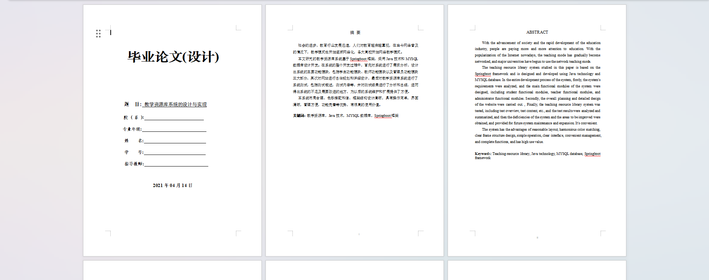
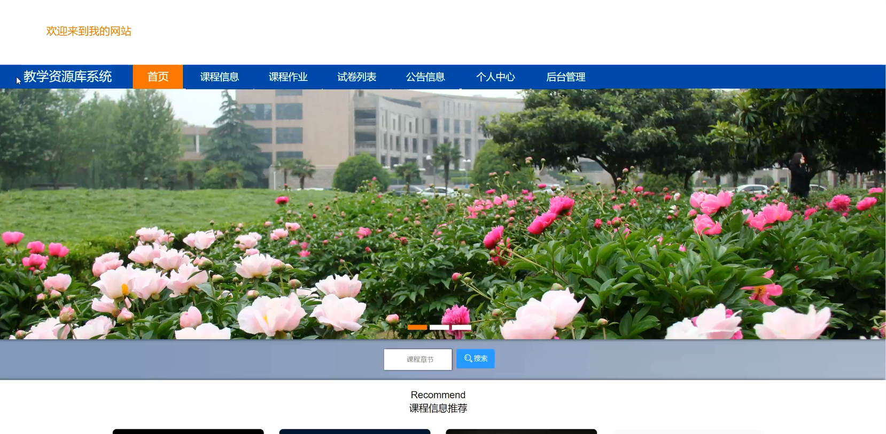
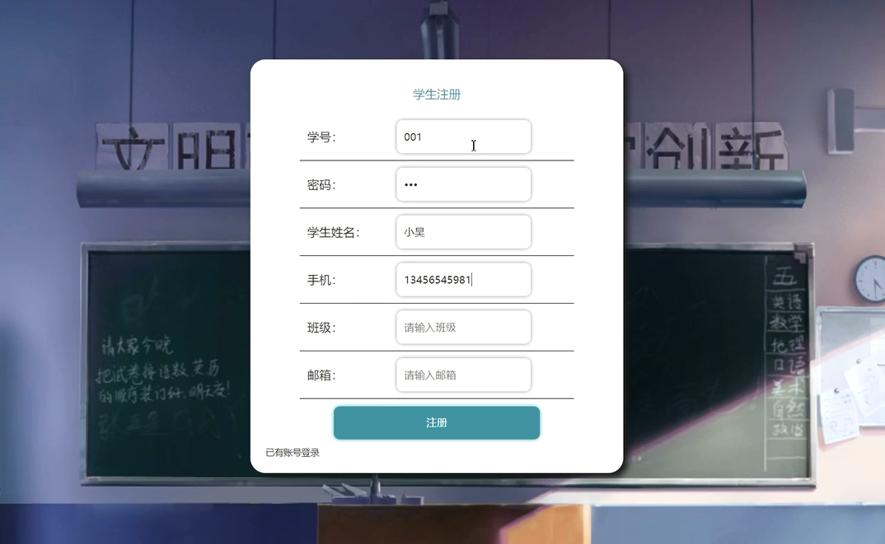
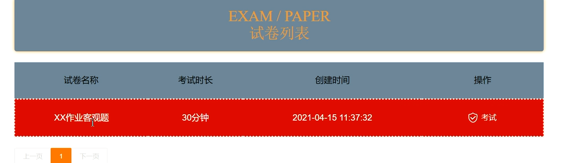
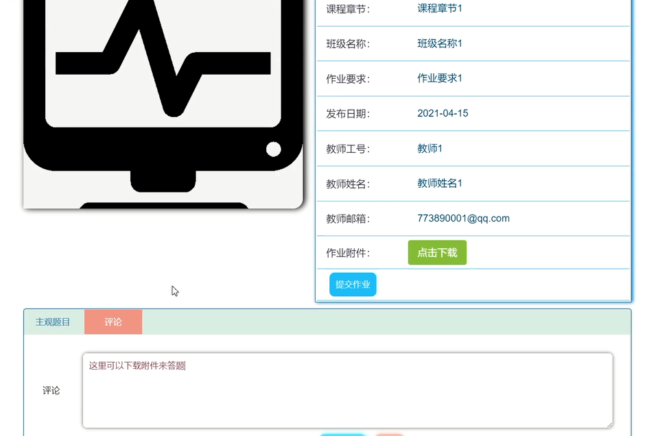
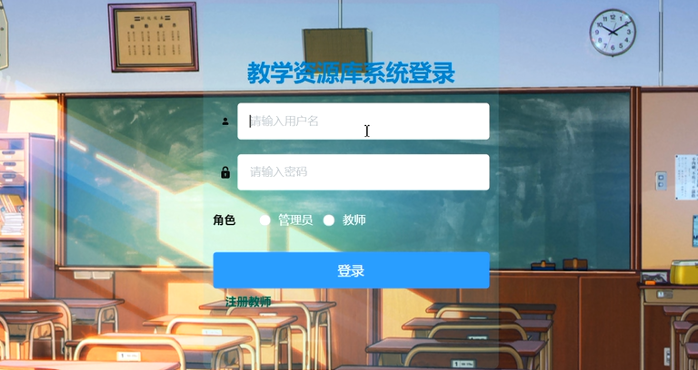

基于Springboot的教学资源库（程序+论文）
=
### 完整代码获取地址：从戎源码网 ([https://armycodes.com/](https://armycodes.com/))
### 作者微信：19941326836  QQ：952045282 
### 承接计算机毕业设计、Java毕业设计、Python毕业设计、深度学习、机器学习
### 选题+开题报告+任务书+程序定制+安装调试+论文+答辩ppt 一条龙服务
### 所有选题地址https://github.com/nature924/allProject

一、项目介绍
---
系统包含两种角色：用户、管理员，系统分为前台和后台两大模块，主要功能如下：

### 1学生功能模块
学生登录系统后，可以访问以下功能模块：

- 系统主界面: 学生进入系统后可查看系统信息。
- 学生注册界面: 没有账号的学生可进行注册操作。
- 课程详情信息界面: 学生可选择课程查看详情，登录后可进行选课、收藏等操作。
- 试卷列表界面: 学生可查看所有试卷并选择考试。
- 课程作业界面: 学生可查看课程作业信息，登录后可提交作业。

### 2 管理员功能模块
管理员登录系统后，可以访问以下功能模块：

- 管理员登录界面: 管理员登录系统后台。
- 学生管理界面: 管理员可查看、修改和删除学生信息。
- 教师管理界面: 管理员可增删改查教师信息。
- 学生成绩管理界面: 管理员可管理学生成绩信息。

### 3教师功能模块
教师登录系统后，可以访问以下功能模块：

- 教师注册界面: 没有账号的教师可进行注册操作。
- 课程信息管理界面: 教师可增删改查课程信息，并可添加作业和查看评论。
- 添加作业界面: 教师可添加课程作业信息。
- 学生选课管理界面: 教师可查看学生选课信息并进行审核。
- 试题管理界面: 教师可增删改查试题信息。

二、项目技术
---
- 编程语言：Java
- 数据库：MySQL
- 项目管理工具：Maven
- 前端技术：VUE、HTML、Jquery、Bootstrap
- 后端技术：Spring、SpringMVC、MyBatis

三、运行环境
---
- 操作系统：Windows、macOS都可以
- JDK版本：JDK1.8以上都可以
- 开发工具：IDEA、Ecplise、Myecplise都可以
- 数据库: MySQL5.7以上都可以
- Tomcat：任意版本都可以
- Maven：任意版本都可以

四、运行截图
---
### 论文截图：

### 程序截图：

